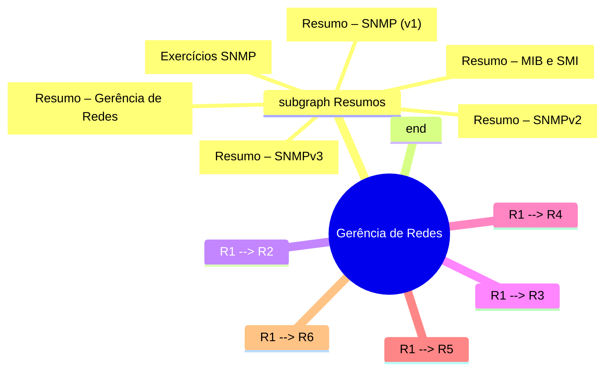

# Gerência de Redes

> **Objetivo:** reunir visualmente todos os resumos produzidos até o momento, facilitando a navegação e o estudo futuro.  
> A sessão "Gerência de Redes" será a base para a próxima sessão "Segurança de Redes".

---

## 📊 Visão geral (Diagrama Mermaid)

*O diagrama acima representa a estrutura de tópicos que será detalhada nas subseções a seguir.*

---

## 📂 Conteúdos disponíveis

| Seção | Descrição breve | Link ao arquivo |
|-------|----------------|-----------------|
| **Resumo – Gerência de Redes** | Conceitos fundamentais de gerenciamento de redes, arquitetura, tipos de gerência (reactiva vs. proativa), ferramentas, arquiteturas (centralizada, hierárquica, distribuída) e modelo OSI. | [resumo_gerencia_redes.md](c:/Users/joxto/Downloads/p2_redes_avancadas/resumo_gerencia_redes.md) |
| **Resumo – MIB e SMI** | Definição da Management Information Base, estrutura de árvore, OIDs, grupos da MIB‑II, e detalhes da Structure of Management Information (SMI). | [resumo_mib_smi.md](c:/Users/joxto/Downloads/p2_redes_avancadas/resumo_mib_smi.md) |
| **Resumo – SNMP (v1)** | Visão geral do Simple Network Management Protocol, camadas, PDUs, segurança baseada em comunidade e fluxo de mensagens. | [resumo_snmp.md](c:/Users/joxto/Downloads/p2_redes_avancadas/resumo_snmp.md) |
| **Resumo – SNMPv2** | Evolução do SNMP, novas operações (GetBulk, Inform), PDUs, códigos de erro ampliados e boas práticas. | [resumo_snmpv2.md](c:/Users/joxto/Downloads/p2_redes_avancadas/resumo_snmpv2.md) |
| **Resumo – SNMPv3** | Arquitetura modular, USM (segurança), VACM (controle de acesso), fluxo de Set seguro e comparação com versões anteriores. | [resumo_snmpv3.md](c:/Users/joxto/Downloads/p2_redes_avancadas/resumo_snmpv3.md) |
| **Exercícios SNMP** | Lista de 10 informações gerenciáveis de um router Cisco ISR 4321 e mapeamento FCAPS dos objetos da MIB‑II. | [exercicios_snmp.md](c:/Users/joxto/Downloads/p2_redes_avancadas/exercicios_snmp.md) |

---

## 📑 Sub‑sessões detalhadas

### 1️⃣ Resumo – Gerência de Redes
> **Arquivo:** `resumo_gerencia_redes.md`

Abrange:
- Introdução, importância das redes, conceitos de gerenciamento.
- Tarefas (detecção de falhas, monitoramento, SLAs, segurança).
- Arquitetura Gerente‑Agente, modelos (centralizado, hierárquico, distribuído).
- Modelo OSI de gerenciamento (organizacional, informacional, funcional – FCAPS).

---

### 2️⃣ Resumo – MIB e SMI
> **Arquivo:** `resumo_mib_smi.md`

Conteúdo:
- História da MIB I/II, estrutura hierárquica de OIDs.
- Definição de objetos, tipos de dados, macros `OBJECT‑TYPE`.
- Exemplo completo de MIB customizada (XYZ Corp.).
- Como ler e interpretar OIDs (numéricos vs. nomes).

---

### 3️⃣ Resumo – SNMP (v1)
> **Arquivo:** `resumo_snmp.md`

Pontos principais:
- Arquitetura gerente‑agente, uso de UDP, PDUs básicas (Get, Set, Trap).
- Segurança baseada em comunidade (`public`, `private`).
- Fluxos de mensagens e limitações (sem garantia de entrega).

---

### 4️⃣ Resumo – SNMPv2
> **Arquivo:** `resumo_snmpv2.md`

Destaques:
- Histórico (Secure SNMP + SMP → SNMPv2c).
- Novas operações: **GetBulk**, **InformRequest**, **Report**.
- PDUs ampliadas e códigos de erro detalhados (0‑18).
- Estratégias de coleta eficiente de tabelas.

---

### 5️⃣ Resumo – SNMPv3
> **Arquivo:** `resumo_snmpv3.md`

Cobertura:
- Arquitetura modular (Engine, Dispatcher, Security, Access Control).
- **USM** (authNoPriv, authPriv) e **VACM** (views, grupos, usuários).
- Fluxo de Set seguro, mensagens Report, comparação com v2c.
- Boas práticas de implantação.

---

### 6️⃣ Exercícios SNMP
> **Arquivo:** `exercicios_snmp.md`

Inclui:
- 10 informações gerenciáveis de um router Cisco ISR 4321 (nome, tipo, acesso, área funcional, descrição).
- Mapeamento FCAPS dos objetos da MIB‑II (System, IP, TCP, UDP, Interfaces).
- Sugestões de uso prático (coleta, monitoramento, configuração).

---

## 🚀 Próximos passos

1. **Estudar a sessão "Segurança de Redes"** – será criada como um novo bloco ao lado desta estrutura.  
2. Utilizar o diagrama acima como guia para aprofundar cada tópico (por exemplo, ao aprofundar USM, voltar ao resumo SNMPv3).  
3. Integrar os exercícios com scripts de coleta (pysnmp, Net-SNMP) para validar os conceitos na prática.

---

*Este documento foi gerado como* **`gerencia_redes_overview.md`** *e pode ser usado como ponto de partida para a sua trilha de aprendizagem.*
